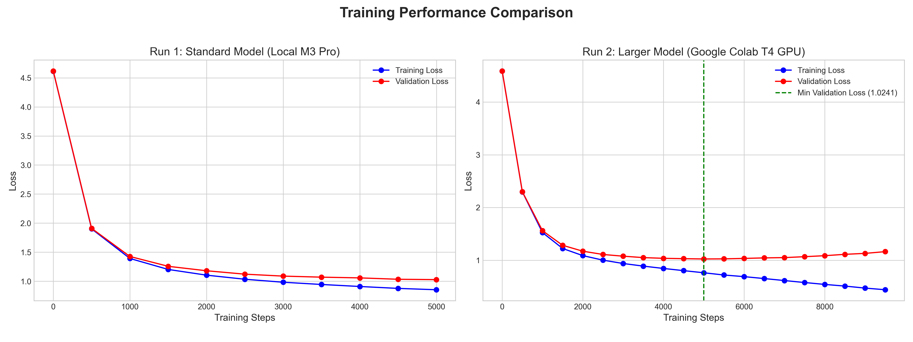

# mahabharataGPT: Character-Level Text Generation with a Custom Transformer

This repository contains a reproducible implementation of a decoder-only Generative Pre-trained Transformer (GPT) model, built from scratch in Python using PyTorch. The project is heavily inspired by and based on the educational "Let's build GPT" tutorial by Andrej Karpathy. This project is trained on the full English text of the ancient Indian epic, the **Mahabharata**.


<p align="center">
  <a href="mahabharataGPT.pdf"><strong>View the Full Research Paper (PDF)</strong></a>
</p>

---

## Table of Contents
- [Project Overview](#project-overview)
- [Key Features](#key-features)
- [Results and Analysis](#results-and-analysis)
  - [Training Performance](#training-performance)
  - [Sample Generation](#sample-generation)
  - [Analysis of Overfitting](#analysis-of-overfitting)
- [How to Use](#how-to-use)
- [Future Work](#future-work)
- [Acknowledgements](#acknowledgements)

---

## Project Overview

The core objective of this project is to build a robust, modular, and well-documented codebase for training a GPT-style model on a unique and complex text. The model is a character-level decoder-only Transformer, learning to predict the next character in a sequence based on the preceding context.

The architecture is built upon the following key principles:
- **Token and Positional Embeddings**: Input text is converted into a sequence of numerical vectors representing both the token's identity and its position.
- **Masked Multi-Head Self-Attention**: The core mechanism that allows the model to weigh the importance of different tokens in the input sequence while respecting the autoregressive (causal) nature of text generation.
- **Position-wise Feed-Forward Networks**: A sub-layer within each Transformer block that provides additional non-linear processing.
- **Residual Connections & Layer Normalization**: Critical components that ensure stable training and efficient gradient flow through the deep network.

## Key Features

- **Modularity**: The codebase is cleanly separated into logical components: `model.py`, `tokenizer.py`, `train.py`, `generate.py`, and `utils.py`.
- **Reproducibility**: All hyperparameters are externalized into `.yaml` configuration files, allowing for easy and reproducible experimentation.
- **Cross-Platform GPU Support**: The training and inference scripts automatically detect and utilize NVIDIA GPUs (`cuda`) or Apple Silicon GPUs (`mps`), falling back to CPU if neither is available.

---

## Results and Analysis

Two primary training runs were conducted: a standard model on a MacBook M3 Pro and a larger model on a Google Colab T4 GPU.

### Training Performance

The training curves below illustrate the performance of both models. The standard model shows healthy convergence, while the larger model begins to overfit after approximately 5000 iterations.



#### Run 1: Standard Model (Local M3 Pro)
This run used the baseline configuration (`n_layer: 6`, `n_embd: 384`, `block_size: 256`) for 5000 iterations.
- **Final Training Loss:** `0.8543`
- **Final Validation Loss:** `1.0283`

#### Run 2: Larger Model (Google Colab T4 GPU)
This run used an expanded configuration (`n_layer: 8`, `n_embd: 512`, `block_size: 512`) and ran for 9500 iterations.
- **Minimum Validation Loss:** `1.0241` (at step 5000)
- **Final Validation Loss:** `1.1631` (at step 9500)

### Sample Generation
The following text was generated by the **Standard Model** (trained locally for 5000 iterations) using the prompt `"According to the historical records of this earth, there once lived a King named Maharaja"`:

>According to the historical records of this earth, there once lived a King named Maharaja Yudhisthira. He who was a favorite of the King, to be killed by the mighty armed princes. In the Mahabharata King of the Rajasuya sacrifice without the Mahadeva seed. The Personality of Godhead many years in the during the Truth. She said, "Think that there is no known to the instruction of pacified by the host. Devavrata cannot be have to been killed, because of the Kuru dynasty, the Pandavas approached in battle and many beautiful men and felt all their mother where he decided to the marriage society, then many destroyer unswervants that was a benediction cannot be become sati.

>Sanjaya said: O Sanjaya, Entitled, the Mahabharata Summation Commanders Duryodhana Charitara. Only a man quarrel, beholding away before Chitrasena and an akshauhini divi's chariot. The earth will exclaim to heavenly roll. Let us go to the holy planets and the sage qualified brahmana.

>Smiling sweetly engaged in the assembly holy blood of Ghatotkacha and his wife. Preed for some time, Duhshasana, and Alambhusha all spoke, "I will, O Suta, without deliver that I will sent your armor to come for all these and trying to kill him. Did King Susharma had given for a deer. Therefore, do not repeat in an equal opportunity to absence of your blession. When He descends to the presence of Krishna, because the great Dvaraka saw their heads would bring him obtain victory, he inquired from Parashurama's chariots' army and killed his horses the King in Virata's ashrama hand. Arjuna then spoke to Nakula to the troops up in water, "O Pandava? Now ham I do?  Yudhisthira was unable, and as they came to be laughing desired."

>Duryodhana agreed, "O Keshava, because you have heard from a time, I want to come here named Sakrata while Satyaki has no mother in battle."

>Hearing the age of Karna's chariot, Drupada replied. "I am quickly of the Gandharvas, transcendental bloody and woman. That Partha can be peace where of Pandu with so a shaft and sent his head to ashing him to fall to see their troops in hand. What could try to pursue the highest of unconstruction, therefore declaring the imperial countries of the Kurus, they have been leaving to the deluge of the field of battle. Only Lord Krishna, when the son of Arjuna, you should speak amount the battlefield. It was enperial body and while he saw thrown my chariot by a thousand who had engaged in the temporary hearts. I want to destroyer your flame. O Partha, the son of Arjuna, O King, do not see tha anyone wind? Why are you ask that you are inversant to end, I can see our abode in the presence of the tanscendental death. They are related in fact with human Yourself and motives. O mighty-armed, I and Dhritarastra still desired to fight with You. O King, You must accept the superior's leader personality of Lord Krishna. With them to confinitely, do you in all much pillows as meant to take place. With affectionation, Summan, you and how can understand that which the princes of the  Gandharvas would not fear that the present Sikhandi will not be sleep. Abhimanyu had left the power of the Gandiva bow, sent up with deep us and smashed you as deadly that he will kill the mighty Bhima with the exhibitation."

>Lord Krishna replied. "The death of Jarasandha ran at Uddhava, "O God, of the Lord of leader, you have lost him from it is not understanding that you trained happiness. Reflecting with a past, Arjuna cannot be seen when you come in a fierce weapon with general, but many men were not difficult foer to exhibit a second in the deed of tour s. You should tried Duryodhana (Shakti), and then will not marry excellent me; they all satisfied Duhshasana. After the Kamyaka warriors had been defeated by the King and carnected for his senses to return how Partha had already been put with many arrows? Mangled with a mighty king, Karna and Ashvatthama has killed up the mighty Karna bow and the two charioteer. He was also set on his charioteer. He astra said his bow to his bow and began to bafflict Karna. Bhima took up his hand, leaving his sheed, the elephant attacked Bhima, and ran at the earth of wealth, speaking that had the one of his heart strong her son. When the child was made finished. With the great warriors shattered, he pierced Bhima with ropes and sent to the Anga battle shafts. Not tolerating those two powerful heroes so from the chariot with his chariot. Bhima then cut it with ten forceful arrows. Bhima then picked up his chariot and killed Kripa's horses that lake. Kritavarman then, kicked up Kratavarman and pierced him with number arrows that countress with many arrows. Along with Duryodhana's son, Bhima sent his horses and charioteer. Standing his stated through the sky, Ashvatthama took out a shower of his chariot, Karna and Ashvatthama. Bhima took another blood and began to dream the other prowess of Laksman's arms, and informed him by Jarasandha, feeling to put the demigods and together, "O son of Prtha, that happened without sweet expermission this death." Dhritarastra then requested her, "O King, for I


#### Analysis of Generated Text
- **Strengths:** The model has clearly learned key elements of the source text. It recognizes major characters (Yudhisthira, Arjuna, Duryodhana, Krishna), the stylistic voice ("O Sanjaya,"), and core concepts (chariots, battle, sacrifices). It successfully generates complex sentences and maintains a consistent, epic tone.
- **Weaknesses:** As expected from a character-level model of this size, there are shortcomings. It exhibits grammatical errors ("cannot be have to been killed"), spelling mistakes ("unswervants"), and "hallucinates" events by combining characters and concepts in ways that don't make logical sense.

### Analysis of Overfitting
The larger model trained on Google Colab clearly overfits. While its training loss continued to decrease sharply, the validation loss hit a minimum around step 5000 and then began to consistently rise. This means the model was no longer learning general patterns from the text but was instead starting to memorize the training data. Its performance on unseen data (the validation set) began to degrade.

---

## How to Use

### Installation
First, clone the repository and set up the Python environment. A virtual environment is highly recommended.
```bash
# Clone the repository
git clone [https://github.com/goofygamer/mahabharataGPT.git](https://github.com/goofygamer/mahabharataGPT.git)
cd mahabharataGPT

# Create and activate a virtual environment
python -m venv venv
source venv/bin/activate  # On Windows use `venv\Scripts\activate`

# Install dependencies
pip install -r requirements.txt
```
### Training
The training process is managed by `src/train.py` and configured by a `.yaml` file.

```bash
# To run training with the default configuration
python src/train.py --config configs/config.yaml
```
Model checkpoints will be saved to the `checkpoints/` directory.

### Generation
Once a model is trained, use src/generate.py to produce new text.

```bash
# Generate text from a trained model checkpoint
python src/generate.py --model_path checkpoints/mahabharata_gpt.pth --prompt "Krishna said to Arjuna,"
```

---

## Future Work
This project serves as a strong foundation. Here are some ways it could be improved:

1. **Resumeable Training**: Implement logic to save and load optimizer states to allow training to be resumed from a checkpoint. This is essential for long runs on cloud platforms like Colab.

2. **Combat Overfitting**: Experiment with higher `dropout` rates or a learning rate scheduler for the larger model to allow it to train for longer without overfitting.

3. **Subword Tokenization**: Move from a character-level tokenizer to a subword tokenizer (like BPE or SentencePiece). This would create a more meaningful vocabulary, reduce sequence length, and likely lead to much more coherent text generation.

4. **Hyperparameter Search**: Systematically experiment with different combinations of `n_layer`, `n_embd`, `n_head`, and `learning_rate` to find an optimal configuration.

---

## Acknowledgements
- This project is heavily inspired by the "Let's build GPT" tutorial by Andrej Karpathy.

- The Mahabharata text is sourced from the [rahulnyk/mahabharata](https://github.com/rahulnyk/mahabharata) GitHub repository.
